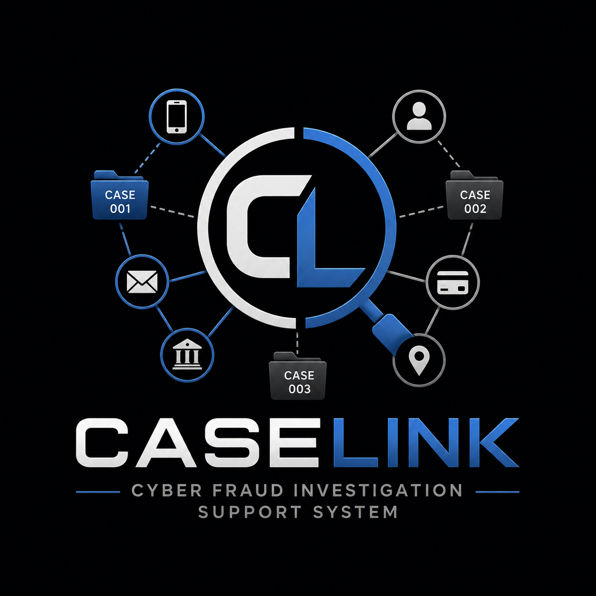
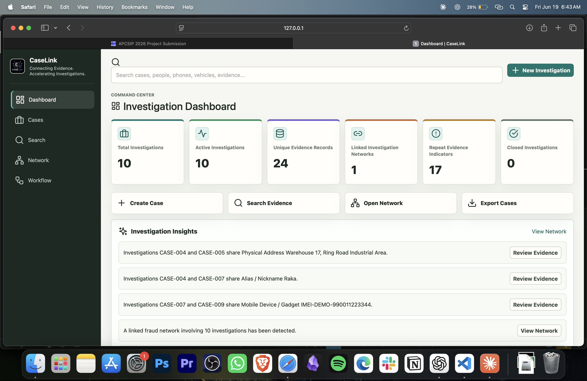
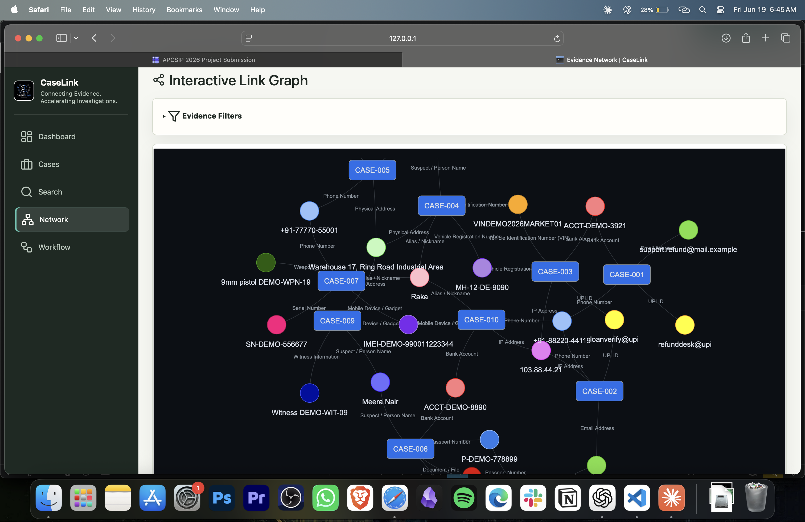
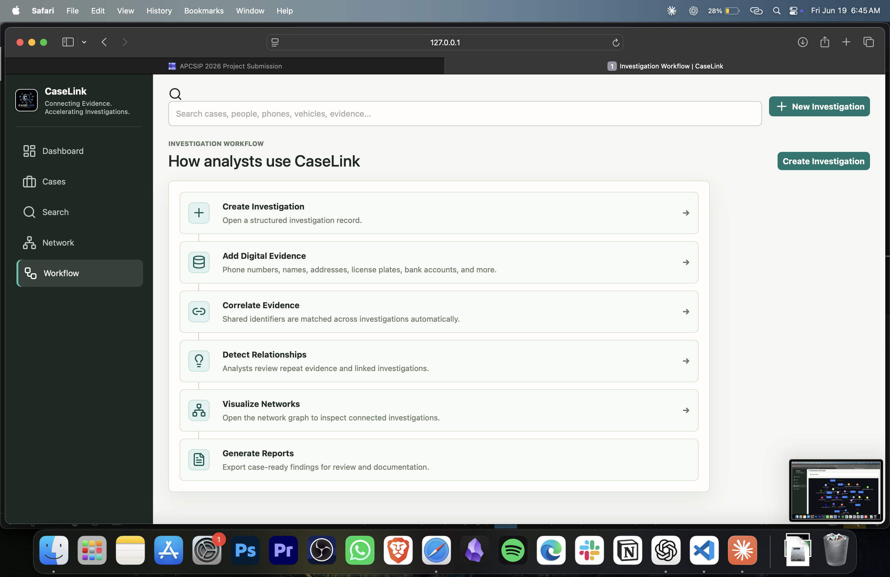

<div align="center">
  
  <h1>CaseLink</h1>
  <h3>Investigation Link Analysis &amp; Intelligence Platform</h3>
  <p><strong>Connecting Evidence. Accelerating Investigations.</strong></p>
  <p><sub>Designed to assist law enforcement and investigators in uncovering hidden relationships across investigations through entity correlation, network visualization, and investigation reporting. Supports cybercrime, vehicle theft, missing persons, financial fraud, property crime, and organized crime investigations.</sub></p>
</div>

## Overview

Investigators across multiple domains receive numerous case reports containing scattered evidence such as phone numbers, bank accounts, email addresses, names, license plates, and physical items.

Identifying hidden relationships between these cases manually is time-consuming and increases the risk of missing organized patterns.

CaseLink is a general-purpose investigation intelligence platform that assists investigators in uncovering relationships across investigations through automated evidence correlation, interactive network visualization, and investigation reporting.

## Architecture / Workflow

```text
Investigation Registration
        |
        v
Evidence Collection
        |
        v
Entity Correlation Engine
        |
        v
Link Detection
        |
        v
Evidence Network Visualization
        |
        v
Investigation Insights
        |
        v
PDF Report Generation
```

## Features

- Correlates shared evidence across investigations.
- Detects direct and indirect relationships between cases.
- Identifies repeat evidence appearing in multiple investigations.
- Generates analyst-friendly investigation insights.
- Visualizes evidence networks using interactive graphs.
- Produces professional PDF investigation reports.
- Provides investigation-wide search capabilities.

## Technology Stack

- **Backend**: Flask, SQLAlchemy
- **Database**: SQLite
- **Graph Analysis**: NetworkX
- **Visualization**: PyVis
- **Reporting**: ReportLab
- **Frontend**: HTML, CSS, JavaScript
- **UI Components**: Bootstrap 5.3, Lucide Icons
- **Typography**: Inter Font

## User Interface

CaseLink features a clean, dark-themed investigation intelligence dashboard with:

### Dashboard Metrics
- **Total Investigations**: Overview of all active and closed cases
- **Active Investigations**: In-progress case count
- **Unique Evidence Records**: Total distinct evidence entities tracked
- **Linked Investigation Networks**: Number of connected investigation clusters
- **Repeat Evidence Indicators**: Entities appearing across multiple investigations
- **Investigation Insights**: AI-generated findings from correlation analysis

### Key Features
- 🔍 **Global Evidence Search**: Find cases and entities across the entire system
- 📊 **Investigation Metrics**: Real-time dashboard with actionable statistics
- 🕸️ **Network Visualization**: Interactive graph showing evidence relationships
- 📋 **Case Management**: Create, update, and track investigations
- ⚡ **Evidence Correlation**: Automated detection of shared identifiers
- 📄 **Report Generation**: Export findings in professional PDF format
- 🎨 **Clean UI**: Dark theme with Lucide icons for intuitive navigation

### Supported Evidence Types
- **Cyber Fraud**: Phone, UPI, Bank Account, Email, IP Address
- **Vehicle/Property**: License Plate, VIN, Address
- **Identity**: Aadhaar, Passport, Name, Alias
- **Physical Evidence**: Weapon, Device, Document, Serial Number
- **Other**: Witnesses

### Investigation Workflow
1. **Create Investigation** - Register a new case with basic details
2. **Add Digital Evidence** - Input phone numbers, identifiers, addresses, and more
3. **Correlate Evidence** - CaseLink automatically matches shared identifiers
4. **Detect Relationships** - Review repeat evidence and linked investigations
5. **Visualize Networks** - Explore evidence connections in an interactive graph
6. **Generate Reports** - Export findings with network diagrams and analysis

## Example Investigation

```text
Case CL-CCU-2026-001
Phone: +91-88220-44119
UPI: loanverify@upi

Case CL-CCU-2026-002
Phone: +91-88220-44119

Case CL-CCU-2026-003
UPI: loanverify@upi
```

CaseLink detects the relationship pattern:

```text
CL-CCU-2026-001
        |
     Phone
        |
CL-CCU-2026-002
        |
      UPI
        |
CL-CCU-2026-003
```

This helps investigators uncover hidden relationships across complaints that may otherwise appear unrelated during manual review.

## Screenshots

### Dashboard



### Evidence Network Visualization



### Investigation Workflow



## Setup

### Windows

```powershell
python -m venv .venv
.\.venv\Scripts\activate
pip install -r requirements.txt
python seed.py
python run.py
```

### macOS / Linux

```bash
python -m venv .venv
source .venv/bin/activate
pip install -r requirements.txt
python seed.py
python run.py
```

Open:

```text
http://127.0.0.1:5000
```

## Notes

The local database file is created at `instance/caselink.sqlite3`. The seed script provides demonstration investigation records for evaluation and testing.
